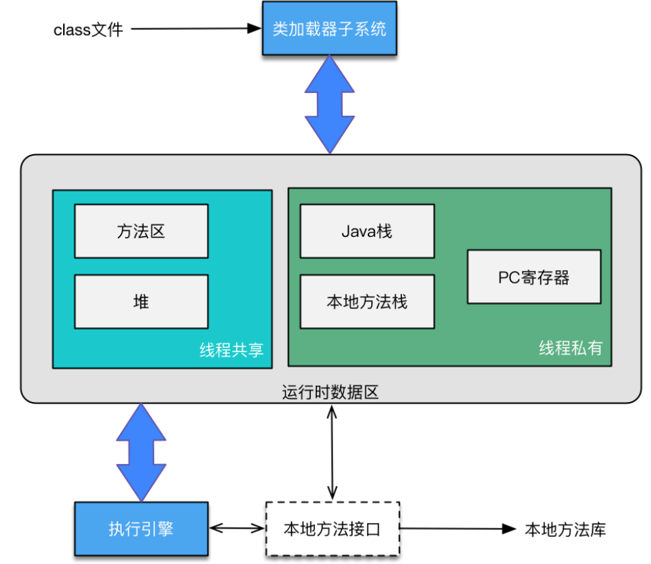
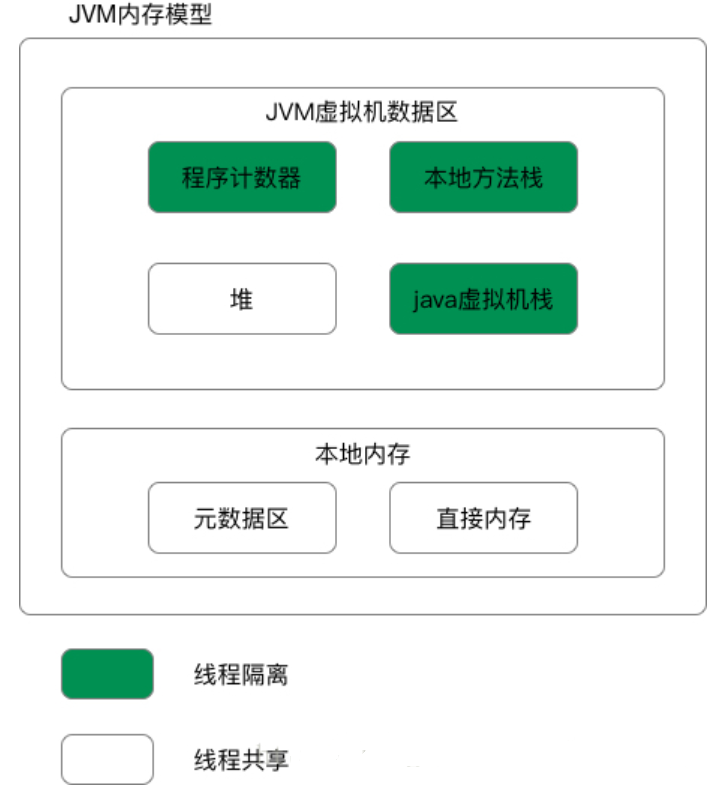

## jdk7 JVM结构

- 堆
> 堆是用来存放对象的内存空间，几乎所有的对象都存储在堆中。
- 方法区
> Java 虚拟机规范中定义方法区是堆的一个逻辑部分。方法区存放以下信息：
 已经被虚拟机加载的类信息   常量   静态变量  即时编译器编译后的代码
>方法区的特点
 线程共享。 方法区是堆的一个逻辑部分，因此和堆一样，都是线程共享的。整个虚拟机中只有一个方法区。
 永久代。 方法区中的信息一般需要长期存在，而且它又是堆的逻辑分区，因此用堆的划分方法，把方法区称为“永久代”。
 内存回收效率低。 方法区中的信息一般需要长期存在，回收一遍之后可能只有少量信息无效。主要回收目标是：对常量池的回收；对类型的卸载。
 Java 虚拟机规范对方法区的要求比较宽松。 和堆一样，允许固定大小，也允许动态扩展，还允许不实现垃圾回收。
> 运行时常量池
 当类被 Java 虚拟机加载后， .class 文件中的常量就存放在方法区的运行时常量池中。而且在运行期间，可以向常量池中添加新的常量。如 String 类的 intern() 方法就能在运行期间向常量池中添加字符串常量。
- 程序计数器
> 程序计数器是一块较小的内存空间，是当前线程正在执行的那条字节码指令的地址。若当前线程正在执行的是一个本地方法，那么此时程序计数器为Undefined。
>> 程序计数器的作用
>字节码解释器通过改变程序计数器来依次读取指令，从而实现代码的流程控制。
>在多线程情况下，程序计数器记录的是当前线程执行的位置，从而当线程切换回来时，就知道上次线程执行到哪了。
> 程序计数器的特点
>>是一块较小的内存空间。
  线程私有，每条线程都有自己的程序计数器。
  生命周期：随着线程的创建而创建，随着线程的结束而销毁。
  是唯一一个不会出现OutOfMemoryError的内存区域。
- 本地方法栈
> 本地方法栈是为 JVM 运行 Native 方法准备的空间，由于很多 Native 方法都是用 C 语言实现的，所以它通常又叫 C 栈。它与 Java 虚拟机栈实现的功能类似，只不过本地方法栈是描述本地方法运行过程的内存模型。
- JVM虚拟机栈
> Java 虚拟机栈是描述 Java 方法运行过程的内存模型。
>Java 虚拟机栈会为每一个即将运行的 Java 方法创建一块叫做“栈帧”的区域，用于存放该方法运行过程中的一些信息，如：
 局部变量表  操作数栈 动态链接 方法出口信息
>由于Java 虚拟机栈是与线程对应的，数据不是线程共享的，因此不用关心数据一致性问题，也不会存在同步锁的问题。
## jdk8 JVM结构
> 堆、MetaSpace、程序计数器、本地方法栈、JVM虚拟机栈

## 参考文章
1. https://jvm.netlify.app/#/
2. https://github.com/doocs/jvm/blob/master/README.md

