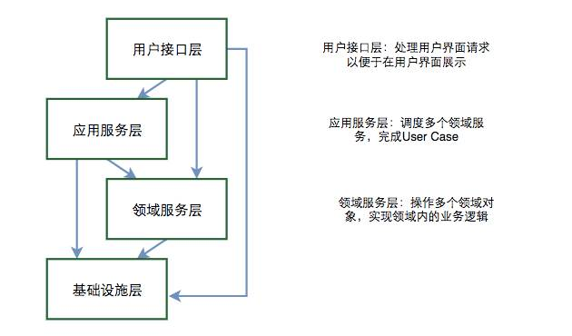

# 领域驱动设计

## 工程结构
com.公司名.组织架构.业务.上下文.*

import com.company.team.bussiness.lottery.*;//抽奖上下文
import com.company.team.bussiness.riskcontrol.*;//风控上下文
import com.company.team.bussiness.counter.*;//计数上下文
import com.company.team.bussiness.condition.*;//活动准入上下文
import com.company.team.bussiness.stock.*;//库存上下文

import com.company.team.bussiness.lottery.domain.valobj.*;//领域对象-值对象
import com.company.team.bussiness.lottery.domain.entity.*;//领域对象-实体
import com.company.team.bussiness.lottery.domain.aggregate.*;//领域对象-聚合根
import com.company.team.bussiness.lottery.service.*;//领域服务
import com.company.team.bussiness.lottery.repo.*;//领域资源库
import com.company.team.bussiness.lottery.facade.*;//领域防腐层

//数据库资源
import com.company.team.bussiness.lottery.repo.dao.AwardPoolDao;//数据库访问对象-奖池
import com.company.team.bussiness.lottery.repo.dao.AwardDao;//数据库访问对象-奖品
import com.company.team.bussiness.lottery.repo.dao.po.AwardPO;//数据库持久化对象-奖品
import com.company.team.bussiness.lottery.repo.dao.po.AwardPoolPO;//数据库持久化对象-奖池
import com.company.team.bussiness.lottery.repo.cache.DrawLotteryCacheAccessObj;//分布式缓存访问对象-抽奖缓存访问
import com.company.team.bussiness.lottery.repo.repository.DrawLotteryRepository;//资源库访问对象-抽奖资源库

