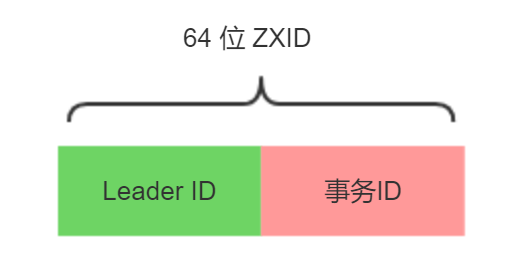

# zookeeper
## 两阶段提交协议
- 第一阶段（请求阶段）
  > 协调者首先会发送某个实付的执行请求给其它所有的参与者，当参与者收到prepare请求时会检查自身并告诉协调者自己的决策是同一还是取消
- 第二阶段（提交阶段）
  > 协调者将根据第一阶段的投票结果发送提交或回滚请求（一般是所有参与者都返回同一就发送提交请求，否则发送回滚请求）。
- 注：两阶段提交协议并不完美，而且存在数据不一致、同步阻塞、单点等问题        

## ZAB算法
https://www.jianshu.com/p/400a44edee88
ZAB 主要是为分布式主备系统设计的，而Paxos的实现是一致性状态机（state machine replication）
proposal
## ZAB特性
1. 一致性保证
 - 可靠提交（Reliable delivery）如果一个事物A被一个server提交（committed）了，那么它最终一定会被所有的server提交
 - 全局有序（Total order） 假设有A、B两个事物，有一台server先执行A再执行B，那么可以保证所有server上A始终都被在B之前执行
 - 因果有序（Causal order）如果发送者在事物A提交之后再发送，那么B比较在A之后执行
2. 只要大多数（法定数量）节点启动，系统就能正常运行
3. 当节点下线后重启，它必须保证能恢复到当前正在执行的事物
## ZAB具体实现
- zookeeper 由client,server两部分构成
- client可以在任何一个server节点上进行读操作
- client可以在任何一个server节点上发起写请求，非leader节点会把此次写请求转发到leader节点上。由leader节点执行
- zookeeper使用改编的两阶段提交协议来保证server节点的事物一致性
## ZXID

> zookeeper会为每一个事物生成一个唯一且递增长度为64为的ZXID，ZXID由两部分组成：低32位表示计数器（counter）和高32位的纪元号（epoch）。epoch位当前leader在成为Leader的时候生成的，
 且会比前一个leader的epoch大
 实际上当新的leader选举成功后，会拿到当前集群中最大的一个ZXID，并去除这个ZXID的epoch,并将此epoch进行加1操作，作为自己的epoch。
## 历史队列（history queue）
> 每一个follower节点都会有一个先进先出（FIFO）的队列用来存放收到的事物请求，保证事物的顺序
> 可靠提交由ZAB的事物一致性协议保证
> 全局有序由TCP协议保证
> 因果有序由follower的历史队列（history queue）保证

## 工作模式
- 广播模式 broadcast
- 恢复模式 recovery
### 广播模式
1. leader从客户端收到一个写请求 
2. leader生成一个新的事物并为这个事物生成一个唯一的ZXID 
3. leader将这个事物发送给所有的follows节点
4. follower节点将收到的事物请求加入到历史队列（history queue）中，并发送ack给leader
5. 当leader收到大多数follower（超过法定数量）的ack消息，Leader会发送commit请求
6. 当follower收到commit请求时，会判断该事物的ZXID是不是比历史队列中的任何事物的ZXID都小，如果是则提交，如果不是则等待比它更小的事物的commit
#### 消息广告的三个步骤
1. 将数据都复制到Follower中
2. 等待Follower回应Ack，最低超过半数即成功
3  当超过半数成功回应，则执行commit，同时提交自己
> 通过以上3个步骤，就能够保持集群之间数据的一致性。实际上，在Leader和Follower之间还有一个消息队列，用来解耦他们之间的耦合，避免同步，实现异步解耦。
>还有一些细节：
 Leader 在收到客户端请求之后，会将这个请求封装成一个事务，并给这个事务分配一个全局递增的唯一 ID，称为事务ID（ZXID），ZAB 兮协议需要保证事务的顺序，因此必须将每一个事务按照 ZXID 进行先后排序然后处理。
 在 Leader 和 Follwer 之间还有一个消息队列，用来解耦他们之间的耦合，解除同步阻塞。
 zookeeper集群中为保证任何所有进程能够有序的顺序执行，只能是 Leader 服务器接受写请求，即使是 Follower 服务器接受到客户端的请求，也会转发到 Leader 服务器进行处理。
 实际上，这是一种简化版本的 2PC，不能解决单点问题。等会我们会讲述 ZAB 如何解决单点问题（即 Leader 崩溃问题）。
 
### 恢复模式
https://www.cnblogs.com/stateis0/p/9062133.html
恢复模式大致可以分为四个阶段
- 选举
- 发现
- 同步
- 广播
1. 当leader崩溃后，集群进入选举阶段，开始选举出潜在的新leader（一般为集群中拥有最大ZXID的节点）
2. 进入发现阶段，follower与潜在的新leader进行沟通，如果发现超过法定人数的follower同意，则潜在的新leader将epoch加1，进入新的纪元。新的leader产生
3. 集群间进行数据同步，保证集群中各个节点的事物一致
4. 集群恢复到广播模式，开始接受客户端的写请求
> 当 leader在commit之后但在发出commit消息之前宕机，即只有老leader自己commit了，
  而其它follower都没有收到commit消息 新的leader也必须保证这个proposal被提交.(新的leader会重新发送该proprosal的commit消息)
  
> 当 leader产生某个proprosal之后但在发出消息之前宕机，即只有老leader自己有这个proproal，
 当老的leader重启后(此时左右follower),新的leader必须保证老的leader必须丢弃这个proprosal.(新的leader会通知上线后的老leader截断其epoch对应的最后一个commit的位置)

#### 奔溃后的问题假设
1. 假设1：Leader 在复制数据给所有 Follwer 之后崩溃，怎么办？
2. 假设2：Leader 在收到 Ack 并提交了自己，同时发送了部分 commit 出去之后崩溃怎么办？
#### 崩溃时 ZAB定义了2个原则
1. ZAB协议确保那些已经在leader提交的事物最终会被所有服务器提交。
2. ZAB协议确保对其那些只在leader提出/复制，但没有提交的事物。
能够确保提交已经被 Leader 提交的事务，同时丢弃已经被跳过的事务。
> 针对这个要求，如果让 Leader 选举算法能够保证新选举出来的 Leader 服务器拥有集群总所有机器编号（即 ZXID 最大）的事务，那么就能够保证这个新选举出来的 Leader 一定具有所有已经提交的提案。
  而且这么做有一个好处是：可以省去 Leader 服务器检查事务的提交和丢弃工作的这一步操作。

#### 崩溃恢复后的数据同步
> 当崩溃恢复之后，需要在正式工作之前（接收客户端请求），Leader 服务器首先确认事务是否都已经被过半的 Follwer 提交了，即是否完成了数据同步。目的是为了保持数据一致。
  当所有的 Follwer 服务器都成功同步之后，Leader 会将这些服务器加入到可用服务器列表中。
  实际上，Leader 服务器处理或丢弃事务都是依赖着 ZXID 的，那么这个 ZXID 如何生成呢？
  答：在 ZAB 协议的事务编号 ZXID 设计中，ZXID 是一个 64 位的数字，其中低 32 位可以看作是一个简单的递增的计数器，针对客户端的每一个事务请求，Leader 都会产生一个新的事务 Proposal 并对该计数器进行 + 1 操作。
  而高 32 位则代表了 Leader 服务器上取出本地日志中最大事务 Proposal 的 ZXID，并从该 ZXID 中解析出对应的 epoch 值，然后再对这个值加一。
> 高 32 位代表了每代 Leader 的唯一性，低 32 代表了每代 Leader 中事务的唯一性。同时，也能让 Follwer 通过高 32 位识别不同的 Leader。简化了数据恢复流程。
  基于这样的策略：当 Follower 链接上 Leader 之后，Leader 服务器会根据自己服务器上最后被提交的 ZXID 和 Follower 上的 ZXID 进行比对，比对结果要么回滚，要么和 Leader 同步。

## zookeeper的数据持久化
http://www.imooc.com/article/details/id/288706

