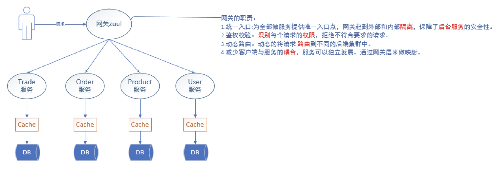

# Zuul

## Zuul架构

## Zuul网关配置总结
　网关配置方式有多种，默认、URL、服务名称、排除|忽略、前缀。
　网关配置没有优劣好坏，应该在不同的情况下选择合适的配置方案。
　zuul网关其底层使用ribbon来实现请求的路由，并内置Hystrix，可选择性提供网关fallback逻辑。使用zuul的时候，并不推荐使用Feign作为application client端的开发实现。毕竟Feign技术是对ribbon的再封装，使用Feign本身会提高通讯消耗，降低通讯效率，只在服务相互调用的时候使用Feign来简化代码开发就够了。而且商业开发中，使用Ribbon+RestTemplate来开发的比例更高。

